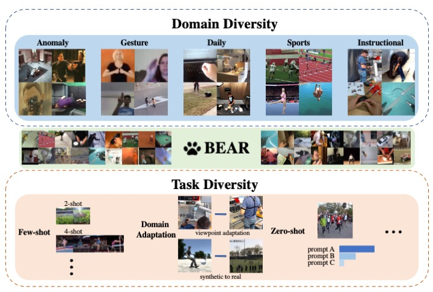
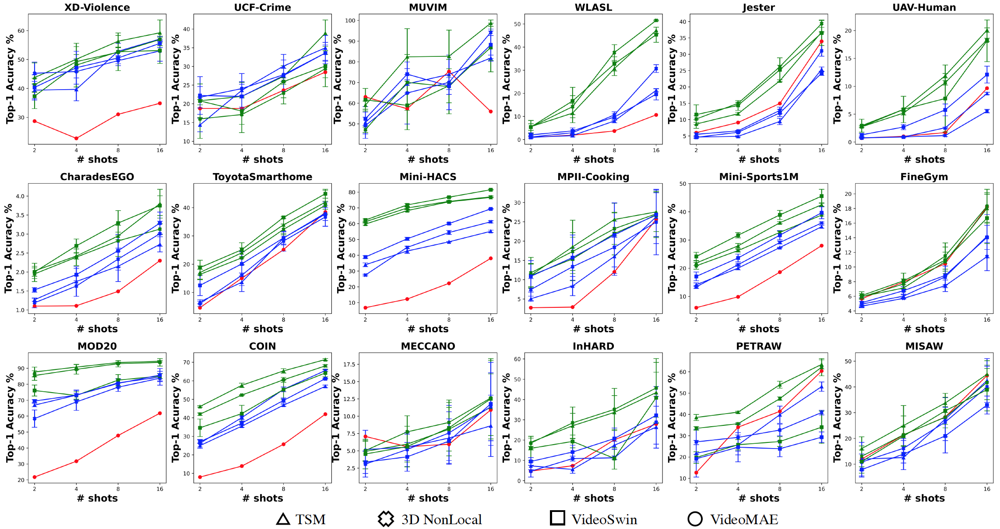
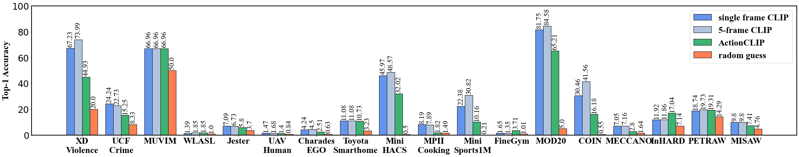

#  BEAR: a new BEnchmark on video Action Recognition
This repo contains the data and pre-trained models in ["A Large-scale Study of Spatiotemporal Representation Learning with a New Benchmark on Action Recognition"](https://arxiv.org/abs/2303.13505)

[Andong Deng](https://dengandong.github.io/)\*, [Taojiannan Yang](https://taoyang1122.github.io/)\*, [Chen Chen](https://www.crcv.ucf.edu/chenchen/)<br>
[Center for Research in Computer Vision](https://www.crcv.ucf.edu/), [University of Central Florida](https://www.ucf.edu/)

[[CVF]](https://openaccess.thecvf.com/content/ICCV2023/papers/Deng_A_Large-scale_Study_of_Spatiotemporal_Representation_Learning_with_a_New_ICCV_2023_paper.pdf)

If you find our work useful in your research, please cite:
```
@article{deng2023BEAR,
  title={A Large-scale Study of Spatiotemporal Representation Learning with a New Benchmark on Action Recognition},
  author={Deng, Andong and Yang, Taojiannan and Chen, Chen},
  journal={arXiv preprint arXiv:2303.13505},
  year={2023}
}
```


## Updates
***04/21/2024*** Update HuggingFace link for pre-trained models.

***08/08/2023*** Update Dropbox link for pre-trained models.

***07/17/2023*** BEAR is accepted by *ICCV 2023*!

***03/24/2023*** Update Dropbox link for [Mini-Sports1M](datasets/mini-Sports1M/).

***03/23/2023*** Initial commits


## Introduction
<div align="center">
    
</div>
The goal of building a benchmark (suite of datasets) is to provide a unified protocol for fair evaluation and thus facilitate the evolution of a specific area. Nonetheless, we point out that existing protocols of action recognition could yield partial evaluations due to several limitations. 

To comprehensively probe the effectiveness of spatiotemporal representation learning, we introduce **BEAR**, a new **BE**nchmark on video **A**ction **R**ecognition. **BEAR** is a collection of 18 video datasets grouped into 5 categories (anomaly, gesture, daily, sports, and instructional), which covers a diverse set of real-world applications. With **BEAR**, we thoroughly evaluate 6 common spatiotemporal models pre-trained by both supervised and self-supervised learning. We also report transfer performance via standard finetuning, few-shot finetuning, and unsupervised domain adaptation. Our observation suggests that current state-of-the-arts cannot solidly guarantee high performance on datasets close to real-world applications and we hope **BEAR** can serve as a fair and challenging evaluation benchmark to gain insights on building next-generation spatiotemporal learners.

The evaluation is **extremely simple** since we provide all scripts in this codebase. The users only need to download datasets and run the scripts provided.


## Datasets
The following table includes all the statistics about the 18 datasets collected in **BEAR**:

| Dataset                                | Domain         | # Classes | # Clip  | Avg Length (sec.) | Training data per class (min, max) | Split ratio | Video source                 | Video viewpoint |
|----------------------------------------|----------------|---------------|-----------|-------------------|-------------------------------------|-------------|------------------------------|----------------|
| [XD-Violence](https://roc-ng.github.io/XD-Violence/)          | Anomaly        | 5             | 4135      | 14.94             | (36, 2046)                          | 3.64:1      | Movies, sports, CCTV, etc.  | 3rd, sur.      |
| [UCF Crime](https://www.crcv.ucf.edu/projects/real-world/)      | Anomaly        | 12            | 600       | 132.51            | 38                                  | 3.17:1      | CCTV Camera                  | 3rd, sur.      |
| [MUVIM](https://arxiv.org/pdf/2206.12740.pdf)        | Anomaly        | 2             | 1127      | 68.1              | (296, 604)                          | 3.96:1      | Self-collected               | 3rd, sur.      |
| [WLASL100](https://dxli94.github.io/WLASL/)             | Gesture        | 100           | 1375      | 1.23              | (7, 20)                             | 5.37:1      | Sign language website        | 3rd            |
| [Jester](https://developer.qualcomm.com/software/ai-datasets/jester)    | Gesture        | 27            | 133349    | 3                 | (3216, 9592)                        | 8.02:1      | Self-collected               | 3rd            |
| [UAV Human](https://github.com/sutdcv/UAV-Human)           | Gesture        | 155           | 22476     | 5                 | (20, 114)                           | 2:1         | Self-collected               | 3rd, dro.      |
| [CharadesEgo](https://prior.allenai.org/projects/charades-ego) | Daily        | 157           | 42107     | 10.93             | (26, 1120)                          | 3.61:1      | YouTube                      | 1st            |
| [Toyota Smarthome](https://project.inria.fr/toyotasmarthome/) | Daily          | 31            | 14262     | 1.78              | (23, 2312)                          | 1.63:1      | Self-collected               | 3rd, sur.      |
| [Mini-HACS](http://hacs.csail.mit.edu/)          | Daily          | 200           | 10000     | 2                 | 50                                  | 4:1         | YouTube                      | 1st, 3rd       |
| [MPII Cooking](https://www.mpi-inf.mpg.de/departments/computer-vision-and-machine-learning/research/human-activity-recognition/mpii-cooking-activities-dataset) | Daily        | 67   | 3748      | 153.04  | (5, 217)  | 4.69:1      | Self-collected  | 3rd  |
| [Mini-Sports1M](https://cs.stanford.edu/people/karpathy/deepvideo/)        | Sports         | 487           | 24350     | 10                | 50                                  | 4:1         | YouTube                      | 3rd            |
| [FineGym99](https://sdolivia.github.io/FineGym/)  | Sports        |  99   | 20389     | 1.65        | (33, 951) | 2.24:1            | Competition videos                 | 3rd |
| [MOD20](https://asankagp.github.io/mod20/)  | Sports        |   20  | 2324     | 7.4        | (73, 107)   | 2.29:1           | YouTube and self-collected         | 3rd, dro. 
| [COIN](https://coin-dataset.github.io/)   | Instructional |  180  | 10426  | 37.01        | (10, 63)    | 3.22:1            | YouTube                            | 1st, 3rd|
| [MECCANO](https://iplab.dmi.unict.it/MECCANO/)  | Instructional |   61  | 7880         | 2.82       | (2, 1157)    | 1.79:1      | Self-collected                     | 1st |
| [INHARD](https://github.com/vhavard/InHARD)   | Instructional |   14  | 5303        | 1.36  | (27, 955)    | 2.16:1            | Self-collected                     | 3rd |
| [PETRAW](https://www.synapse.org/#!Synapse:syn25147789)   | Instructional |    7  | 9727      | 2.16       | (122, 1262)       | 1.5:1    | Self-collected                     | 1st |
| [MISAW](https://www.synapse.org/#!Synapse:syn21776936/wiki/601700)    | Instructional |   20  | 1551     | 3.8       | (1, 316)   | 2.38:1             | Self-collected                     | 1st | 


## Datasets Download and Pre-processing
We provide downloading and pre-processing pipeline [here](datasets#download-and-preprocessing) for each dataset.

The HuggingFace link for part of BEAR datasets are here:

[Mini-Sports1M](https://huggingface.co/datasets/dengandong/BEAR-Mini-Sports1M)
[Jester](https://huggingface.co/datasets/dengandong/BEAR-Jester)
[FineGym](https://huggingface.co/datasets/dengandong/BEAR-FineGym)
[MOD20](https://huggingface.co/datasets/dengandong/BEAR-MOD20)
[MPII-Cooking2](https://huggingface.co/datasets/dengandong/BEAR-MPII-Cooking2)

## Pre-trained Models
We prepare Kinetics-400 pre-trained models with both supervised and self-supervised pre-training:

The updated HuggingFace Link for both self-supervised pretraining and supervised pretraining are here:

[SSL](https://huggingface.co/dengandong/BEAR_SSL)  [SUP](https://huggingface.co/dengandong/BEAR_SUP)

The pre-trained models can be downloaded from below if needed:
| model         | Supervised (Top-1 Accuracy) | Self-supervised (KNN evaluation)  |
| ------------- | --------- | ---- |
| TSN           | 77.6 [Dropbox](https://www.dropbox.com/scl/fi/66ckz8k0zslgpv41bna15/tsn_convnext_8frame_k400.pth?rlkey=86g82ctliivlnsnohg644q1c6&dl=0)      | 43.1 [Dropbox](https://www.dropbox.com/scl/fi/irzynudf5f440j1bf96fg/convnext_tsn_ssl.pyth_converted.pth?rlkey=9tcyr5n7lwfgq1769timbf0uj&dl=0) |
| TSM           | 76.4 [Dropbox](https://www.dropbox.com/scl/fi/f1rd8v2j370m5fjmb9q7e/tsm_convnext_8frame_k400.pth?rlkey=8hve0s4tqn7ierw9w6hnk25wq&dl=0)      | 43.2 [Dropbox](https://www.dropbox.com/scl/fi/asbxesoytijqlu6gtn7rz/tsm_ssl_k400_converted.pth?rlkey=8sdhnzui4n465pjsndds6vxov&dl=0) |
| I3D           | 74.2 [Dropbox](https://www.dropbox.com/scl/fi/xmlmpbrbl2whtnocinbl5/i3d_best_at_25e_k400.pth?rlkey=b1n8sc8bpyazwpk0mk2dpv6vl&dl=0)      | 51.3 [Dropbox](https://www.dropbox.com/scl/fi/ptr4oxzyw61qg0gi4u7aj/convnext_i3d_ssl_converted.pth?rlkey=8oghtx21ibjdgbnjf67ds6d4y&dl=0) |
| NL            | 73.9 [Dropbox](https://www.dropbox.com/scl/fi/leklbhqze9zb8ezyokn9d/nonlocal_best_at_27epoch.pth?rlkey=6ia0f96vulp35m8in8awhx7lx&dl=0)      | 50.7 [Dropbox](https://www.dropbox.com/scl/fi/l8f0856njxmhxkoyt364b/i3dnonlocal_ssl_k400_converted.pth?rlkey=p4yk4wp4949p9qgy0ut9bcd5r&dl=0) |
| TimeSformer   | 75.8 [Dropbox](https://www.dropbox.com/scl/fi/al0yo1g0lxijbyvqe9nog/timesformer_divST_8x32x1_15e_kinetics400_rgb-3f8e5d03.pth?rlkey=07d8nczq5c3rczrrjammyg7wb&dl=0)      | 50.3 [Dropbox](https://www.dropbox.com/scl/fi/et1r255z294s0bkorobg0/timesformer_ssl_8frame.pyth?rlkey=3hu1y8pkrss71fmidlvl5vff6&dl=0) |
| VideoSwin     | 77.6 [Dropbox](https://www.dropbox.com/scl/fi/se10ntf2ijqeciwqylz6o/videoswin_8frame_30epoch.pth?rlkey=8u029stmnha5v9naqeutjofwp&dl=0)      | 51.1 [Dropbox](https://www.dropbox.com/scl/fi/qv28b9vrfd95xn84dwtzo/videoswin_8frame_ssl.pth?rlkey=4l65j2j9txncb5hqaiat0lswf&dl=0) |


## Benchmark
Based on pre-trained models on Kinetics400, we provide 4 types of evaluation paradigms in **BEAR**: 

[BEAR-Standard](#standard-finetuning)<br>
[BEAR-Fewshot](#few-shot-finetuning)<br>
[BEAR-Zeroshot](#zero-shot-evaluation)<br>
[BEAR-UDA](#domain-adaptation)<br>


## Standard Finetuning
We build our stanard finetuning based on a popular video understanding toolbox [MMAction2](https://github.com/open-mmlab/mmaction2).

We provide specific training steps [here](benchmark/BEAR-Standard/).

The finetuning results of supervised pre-training are shown below: 

| **Dataset**           | TSN   | TSM   | I3D   | NL    | TimeSformer | VideoSwin |
|------------------|-------|-------|-------|-------|-------------|-----------|
| **XD-Violence** | **85.54** | 82.96 | 79.93 | 79.91 | 82.51 | 82.40 | 75.11 | 80.49 | **81.73** | 80.38 | 80.94 | 77.47 | 77.91 |
| **UCF-Crime**    | 35.42     | **42.36** | 31.94 | 34.03 | 36.11  | 34.72  | 25.69  | **37.50** | 35.42     | 34.03  | 34.72  | 36.11  | 34.03  |
| **MUVIM**        | 79.30     | **100** | 97.80 | 98.68 | 94.71  | **100** | 99.56  | 99.12  | **100**    | 66.96  | 66.96  | 99.12  | **100** |
| **WLASL**        | 29.63     | 43.98 | 49.07 | **52.31** | 37.96  | 45.37  | 44.91  | 27.01  | 27.78     | 29.17  | **30.56** | 25.56  | 28.24  |
| **Jester**       | 86.31     | **95.21** | 92.99 | 93.49 | 93.42  | 94.27  | 92.24  | 83.22  | **95.32**  | 87.23  | 93.89  | 90.33  | 90.18  |
| **UAV-Human**    | 27.89     | **38.84** | 33.49 | 33.03 | 28.93  | 38.66  | 36.07  | 15.70  | 30.75     | 31.95  | 26.28   | 21.02       | 35.12     |
| **CharadesEGO** | 8.26 | 8.11 | 6.13 | 6.42 | **8.58** | 8.55 | 5.69 | 6.29 | 6.59 | 6.24 | 6.31 | 7.59 | **7.65** |
| **Toyota Smarthome** | 74.73 | **82.22** | 79.51 | 76.86 | 69.21 | 79.88 | 79.09 | 68.71 | **81.34** | 77.82 | 76.16 | 61.64 | 80.18 |
| **Mini-HACS** | 84.69 | 80.87 | 77.74 | 79.51 | 79.81 | **84.94** | 60.57 | 64.60 | 63.24 | 70.24 | 60.57 | 73.92 | **75.58** |
| **MPII Cooking** | 38.39 | 46.74 | **48.71** | 42.19 | 40.97 | 46.59 | 42.19 | 34.45 | **50.08** | 42.79 | 40.36 | 35.81 | 47.19 |
| **Mini-Sports1M** | 54.11 | 50.06 | 46.90 | 46.16 | 51.79 | **55.34** | 41.91 | 43.02 | 43.59 | 46.28 | 45.56 | 44.60 | **47.60** |
| **FineGym** | 63.73 | **80.95** | 72.00 | 71.21 | 63.92 | 65.02 | 68.49 | 54.62 | **75.87** | 69.62 | 68.79 | 47.60 | 58.94 |
| **MOD20** | **98.30** | 96.75 | 96.61 | 96.18 | 94.06 | 92.64 | 92.08 | 91.23 | 92.08 | 91.94 | 92.08 | 90.81 | **92.36** |
| **COIN** | 81.15 | 78.49 | 73.79 | 74.30 | **82.99** | 76.27 | 61.29 | 61.48 | 64.53 | 71.57 | **72.78** | 67.64 | 68.78 |
| **MECCANO** | **41.06** | 39.28 | 36.88 | 36.13 | 40.95 | 38.89 | 30.78 | 32.34 | 35.10 | 34.86 | 33.62 | 33.30 | **37.80** |
| **InHARD** | 84.39 | **88.08** | 82.06 | 86.31 | 85.16 | 87.60 | 84.86 | 75.63 | **87.66** | 82.54 | 80.81 | 71.28 | 80.10 |
| **PETRAW** | 94.30 | 95.72 | 94.84 | 94.54 | 94.30 | **96.43** | 95.46 | 93.18 | **95.51** | 95.02 | 94.38 | 85.56 | 91.46 |
| **MISAW** | 61.44 | **75.16** | 68.19 | 64.27 | 71.46 | 69.06 | 69.06 | 59.04 | **73.64** | 70.37 | 64.27 | 60.78 | 68.85 |

The finetuning results of self-supervised pre-training are shown below: 

| **Dataset**           | TSN   | TSM   | I3D   | NL    | TimeSformer | VideoSwin |
|-------------------|-------|-------|-------|-------|-------------|-----------|
| **XD-Violence**  | 80.49 | **81.73** | 80.38 | 80.94 | 77.47 | 77.91 |
| **UCF-Crime**    | **37.50** | 35.42     | 34.03  | 34.72  | 36.11  | 34.03  |
| **MUVIM**        | 99.12  | **100**    | 66.96  | 66.96  | 99.12  | **100** |
| **WLASL**        | 27.01  | 27.78     | 29.17  | **30.56** | 25.56  | 28.24  |
| **Jester**       | 83.22  | **95.32**  | 87.23  | 93.89  | 90.33  | 90.18  |
| **UAV-Human**    | 15.70  | **30.75**     | 31.95  | 26.28   | 21.02       | 35.12     |
| **CharadesEGO** | 6.29 | 6.59 | 6.24 | 6.31 | 7.59 | **7.65** |
| **Toyota Smarthome** | 68.71 | **81.34** | 77.82 | 76.16 | 61.64 | 80.18 |
| **Mini-HACS** | 64.60 | 63.24 | 70.24 | 60.57 | 73.92 | **75.58** |
| **MPII Cooking** | 34.45 | **50.08** | 42.79 | 40.36 | 35.81 | 47.19 |
| **Mini-Sports1M** | 43.02 | 43.59 | 46.28 | 45.56 | 44.60 | **47.60** |
| **FineGym** | 54.62 | **75.87** | 69.62 | 68.79 | 47.60 | 58.94 |
| **MOD20** | 91.23 | 92.08 | 91.94 | 92.08 | 90.81 | **92.36** |
| **COIN** | 61.48 | 64.53 | 71.57 | **72.78** | 67.64 | 68.78 |
| **MECCANO** | 32.34 | 35.10 | 34.86 | 33.62 | 33.30 | **37.80** |
| **InHARD** | 75.63 | **87.66** | 82.54 | 80.81 | 71.28 | 80.10 |
| **PETRAW** | 93.18 | **95.51** | 95.02 | 94.38 | 85.56 | 91.46 |
| **MISAW** | 59.04 | **73.64** | 70.37 | 64.27 | 60.78 | 68.85 |


## Few-shot Finetuning
Please follow the instructions [here](benchmark/BEAR-Fewshot/) to perform few-shot evaluation on **BEAR**.

The few-shot results are shown below: 

<div align="center">
    
</div>

## Zero-shot Evaluation
We build our zero-shot part based on the popular [CLIP](https://github.com/openai/CLIP) and [ActionCLIP](https://github.com/sallymmx/actionclip). Follow the instructions [here](benchmark/BEAR-Zeroshot/) to evaluate zero-shot performance on **BEAR**.

The zero-shot results are shown below: 

<div align="center">
    
</div>


## Domain Adaptation
Please follow the instructions [here](benchmark/BEAR-UDA/) to perform UDA evaluation on **BEAR**.

The UDA baseline results are shown below: 
| Dataset               |   T>M    | M>T | MS>MOD | MOD>MS | U>X | X>U | P>MS | Jester | IT>IL | IT>IR | IL>IR | IL>IT | IR>IT | IR>L |
|-----------------------|-----------|---------|---------|---------|---------|---------|---------|--------|---------|---------|---------|---------|---------|---------|
| Source only           | 5.32    | 7.36    | 18.25   | 12.76   | 54.20   | 33.33   | 61.45   | 68.73  | 4.18    | 30.39   | 19.01   | 22.65   | 24.14   | 12.42   |
| Supervised target     | 70.21   | 65.13   | 34.08   | 35.52   | 75.06   | 63.89   | 94.40   | 97.61  | 26.00   | 83.55   | 83.55   | 85.52   | 85.52   | 26.00   |


