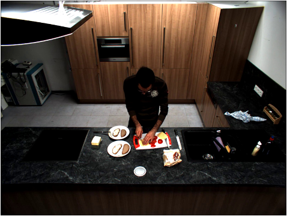
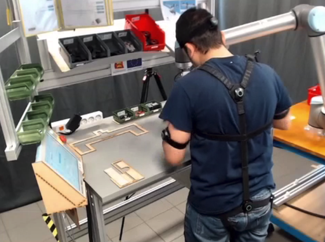
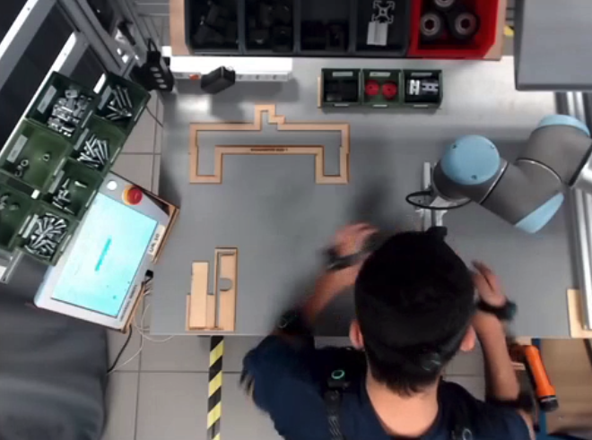
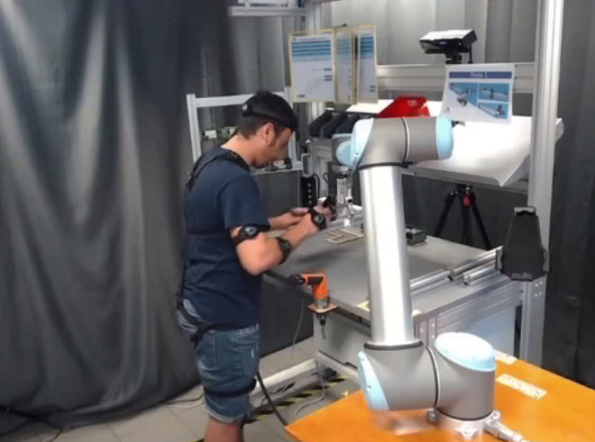

# BEAR UDA


In BEAR, we provide two different types of domain adaptation paradigm: 

**Inter-dataset** is constructed based on two different datasets that have different distributions, especially viewpoint change, but share common categories. For instance, Mini-Sports1M and MOD20 are collected from different data sources but they both describe a variety of sports-related actions. Totally, we construct 4 paired datasets following the inter-dataset rule:
three of them are from the 18 datasets (ToyotaSmarthome and MPII-Cooking, Mini-Sports1M and MOD20, UCF-Crime and XD-Violence), and the other is constructed by a synthetic sports dataset named PHAV and Mini-Sports1M. 

**Intra-dataset**, on the contrary, is built within one dataset that records the same actions differently. For example, InHARD has three different views for each video sample and we simply construct 6 paired datasets for the UDA study. Besides, we also include the popular Jester(S-T) [48] in our benchmark. The details of the dataset construction can be found in Appendix G. 

We provide two common baseline results: **Source only** and **Supervised target**. The former directly evaluates the model trained on the source training set with the target test set, and the latter is the supervised learning performance on the target domain. 

## Introduction

We provide MMAction2-format annotations in [data](data/). You can easily run your experiments via defining your source data and target data. We provide the **T-->M**(ToyotaSmarthome --> MPII-Cooking) I3D training with **Source only** on 8 GPUs as an example here:

```
bash tools/dist_train.sh configs/datasets/mpii_cooking/swin_base_patch244_window877_8x16_ucf_crime.py 8 
--validate 
--cfg-options load_from=${YOUR_PRETRAINED_I3D}
              data.videos_per_gpu=4 work_dir=${YOUR_WORK_DIR} 
              data_root=${YOUR_T_DATA_ROOT}
              data_root_val=${YOUR_M_DATA_ROOT}
```

### Example of ToyotaSmarthome<-->MPII-Cooking:

<div align="center">
    <div style="display: inline-block;">
        
    </div>
    <div style="display: inline-block;">
        
    </div>
</div>


### Example of InHARD:

<div align="center">
    <div style="display: inline-block; width: 33%">
        
    </div>
    <div style="display: inline-block; width: 33%">
        
    </div>
    <div style="display: inline-block; width: 33%">
        
    </div>
</div>

